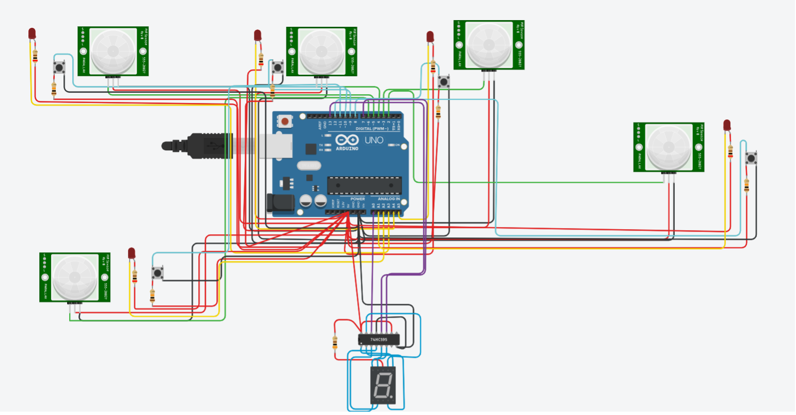
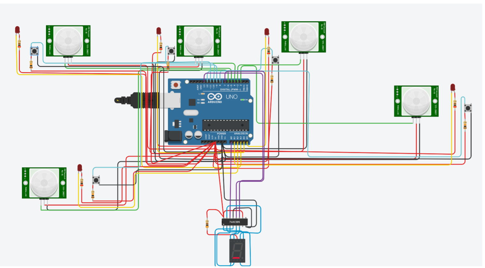
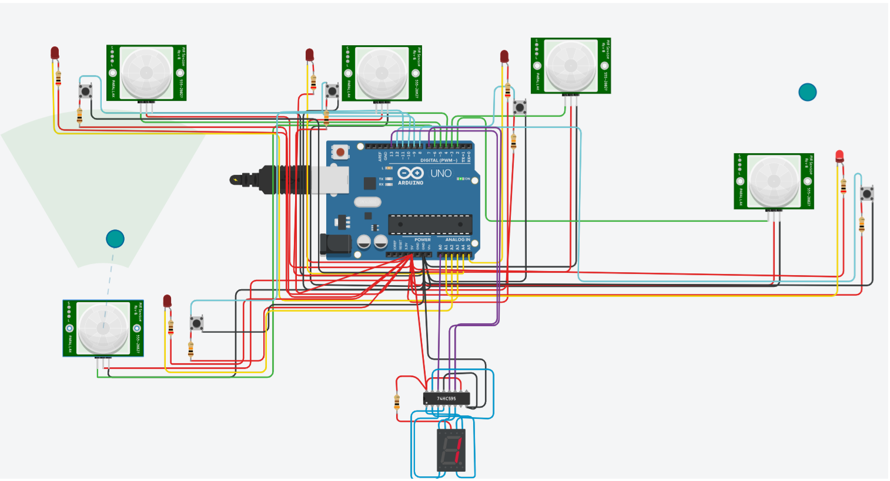

# System Alarmowy na ATMega328P

**Link do projektu w tinkercad**: https://www.tinkercad.com/things/kB7BH8ezySH-askproj2?sharecode=o86rJ7XlRn4ZpE0Tyh85V4lGz5SdO3RtpsPyIC5kAf8

## Opis projektu

Projekt systemu alarmowego opartego na mikrokontrolerze ATMega328P (Arduino), który obsługuje 5 czujników PIR. System umożliwia:

- Włączenie/wyłączenie każdego z pir.
- Każdy z czujników pir posiada diode LED:  
  - **LED świeci**, czujnik jest aktywny.  
  - **LED zgaszony**, czujnik  jest nieaktywny.
- Panel led wyświetla status alarmu:  
  - **Symbol górnej kreski** oznacza aktywny alarm.  
  - **Symbol dolnej kreski** oznacza nieaktywny alarm.
- Na panelu led wyświetlana jest również liczba czujników PIR które wykryły ruch, liczba wyświetlana jest dopóki czujnik nie zostanie wyłączony.

---
## Użyte komponenty

- Mikrokontroler **ATMega328P** (np. Arduino UNO/Nano).
- 5x Czujniki PIR (podłączone do pinów 3, 4, 5, 6, 2).
- 5x Diody LED (podłączone do pinów A5, A4, A3, A2, A1).
- 5x Przyciski (podłączone do pinów 8, 9, 10, 11, 12).
- Wyświetlacz LED (7-segmentowy).
- Rejestr przesuwny 74HC595 (do podłączenia wyświetlacza LED).
- Rezystory, przewody, zasilanie.
---
## Działanie alarmu
**Alarm wyłączony** -> Żaden czujnik PIR nie jest włączony.



---
**Alarm włączony** -> Conajmniej jeden czujnik PIR jest włączony.


---
**Wykrywanie ruchu** -> Ekran wyświetla liczbę czujników PIR które wykryły ruch.


---
**Wyłączenie czujników** -> Gdy czujniki PIR wykryją ruch, liczba na ekranie nie zmienia się dopóki, czujnik nie zostanie wyłączony



---

## Struktura Kodu
**Deklaracja pinów oraz zmiennych**
- pirPins[] - tablica przechowująca piny czujników PIR.
- buttonPins[] - tablica przechowująca piny przycisków.
- ledPins[] - tablica przechowująca piny diod LED.
- sensorEnabled[] - tablica przechowująca stany czujników.
- motionDetected[] - tablica przechowująca stan wykrycia ruchu.
- cyfry[5] = {121, 36, 48, 25, 18} - tablica zawierająca wartości binarne cyfr dla wyświetlacza od 1 do 5.

**Funkcja setup()**

```cpp
void setup() {
  for (int i = 0; i < numSensors; i++) {
    pinMode(pirPins[i], INPUT);
    pinMode(buttonPins[i], INPUT_PULLUP);
    pinMode(ledPins[i], OUTPUT);
  }
  pinMode(datapin, OUTPUT);
  pinMode(latchpin, OUTPUT);
  pinMode(clockpin, OUTPUT);
  Serial.begin(9600);
} 

